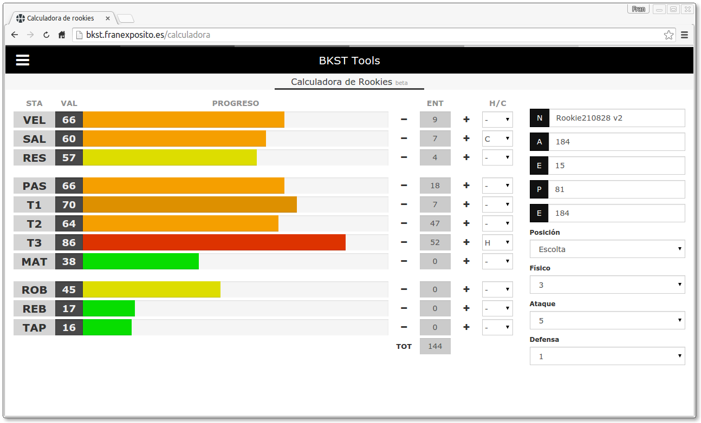
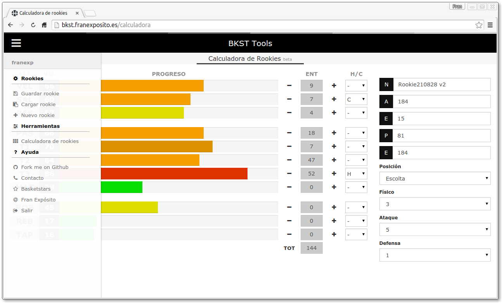
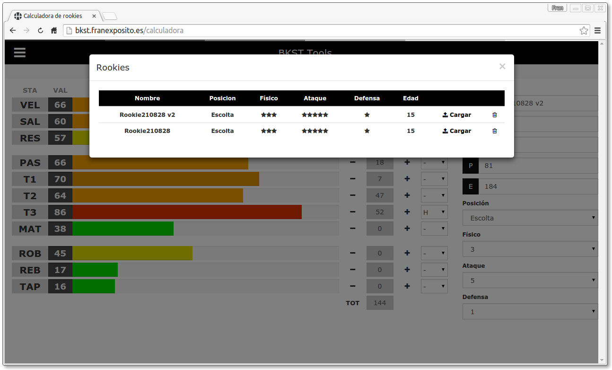
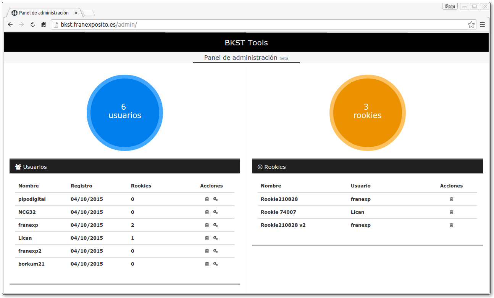
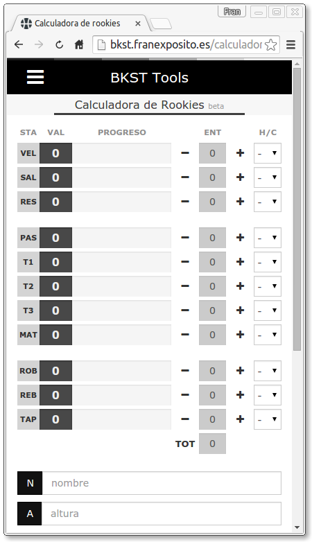

#Basketstars Calculator
Sencilla aplicación web complemento de [Basketstars](http://basketstars.com) que realiza el cálculo de los entrenamientos de un rookie y los almacena para poder cargarlos en cualquier momento.  

[Demo](http://bkst.franexposito.es/calculadora)  

* Escrito en PHP, HTML5, Javascript, Jquery y Bootstrap.  
* Menú desplegable.  
* Guardado y carga de base de datos desde Ajax.  

###Capturas
  

  

  

  

Siéntete libre de coger el código y modificarlo para echarme una mano.